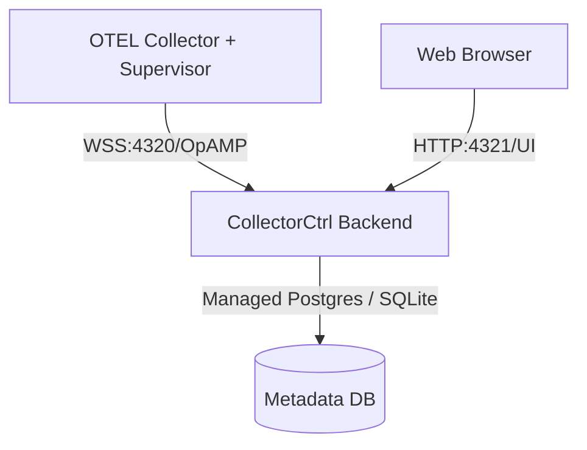

# CollectorCtrl — Enterprise OpAMP Management

CollectorCtrl is a professional, high-performance management server for **OpenTelemetry Collectors**, based on the [OpAMP](https://github.com/open-telemetry/opamp-spec) protocol. It provides a centralized control plane for managing agent lifecycle, configuration, monitoring, and remote upgrades of observability fleets.

## Key Features

- **Fleet Management**: Centralized overview of all connected OpAMP agents and their supervisors.
- **Remote Configuration**: Push, roll back, and manage collector configurations at scale.
- **Health & Monitoring**: Real-time health reporting and metric visibility for the entire fleet.
- **Package Management**: Remote upgrades and custom package distribution for OTEL collectors.
- **Windows Service Ready**: Natively runs as a Windows Service for production stability.
- **Unified Deployment**: The Go backend serves the frontend assets directly—no Node.js needed in production.

## Architecture

CollectorCtrl consists of a high-performance **Go Backend** and a modern **React-based Web UI**.



## Production Readiness

CollectorCtrl is engineered to scale from a single lab instance to enterprise-grade fleets.

- **Dual-Storage Engine**: Supports lightweight **SQLite** for rapid development and **PostgreSQL** for high-concurrency production workloads.
- **Windows Installer**: Automated `.exe` installer via Inno Setup for easy deployment on Windows Server.
- **Upgrade Path**: Built-in database auto-migrations ensure zero data loss during version upgrades.

## Getting Started

### Production Deployment (Windows)
1. Download the latest `CollectorCtrl_Setup.exe` from [GitHub Releases](https://github.com/CollectorCtrl/CollectorCtrl/releases).
2. Run the installer as Administrator.
3. The service will be installed and started automatically.
4. Access the UI at `http://localhost:4321`.

### Development Build
```powershell
# Build everything (Frontend + Backend + Installer)
.\build_all.ps1
```

## Documentation
- [Feature Overview](docs/features.md)
- [Technical Architecture](docs/architecture.md)
- [Security & Compliance](docs/security.md)
- [Setup & Development Guide](SETUP.md)

---
*Created and maintained with love for the observability community.*
