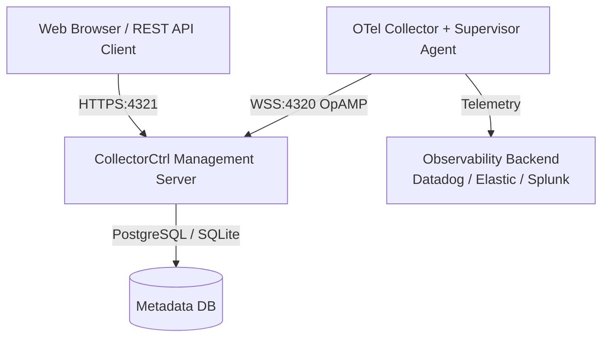

# CollectorCtrl — OpenTelemetry Fleet Control & Governance

CollectorCtrl is the definitive platform for **centrally managing, dynamically configuring, and actively observing** your OpenTelemetry infrastructure. Built on the [OpAMP](https://github.com/open-telemetry/opamp-spec) (Open Agent Management Protocol), it provides an enterprise-grade, on-prem control plane for managing agent lifecycle, configuration, monitoring, and drift prevention across your entire observability fleet.

> 🚀 **CollectorCtrl Beta v0.2.0 for Windows & Linux is Live** — [Download on GitHub →](https://github.com/CollectorCtrl/CollectorCtrl/releases)

## Key Features

- **Dynamic Target Policies**: Apply Kubernetes-style label selectors to target precise collector rings. Supervisors hot-reload pipelines in real time — no restarts, no downtime.
- **Drift Prevention**: CollectorCtrl is the single source of truth. It continuously validates edge configs against defined policies and auto-corrects any divergence.
- **Atomic Versioning & Canary Rollouts**: Every YAML edit is SHA-hashed and versioned. Deploy to a canary ring first, validate under real load, then promote — or rollback in milliseconds.
- **Hybrid Sidecar Pipelines**: Isolate your observability pipeline from your intelligence pipeline — run separate OTel components for SIEM routing and AI processing without polluting your core telemetry path.
- **OIDC Identity & SSO**: Integrate with Azure AD, Okta, and Auth0. Just-in-Time account provisioning with dynamic group-to-role mappings.
- **SIEM OTLP Audit Streaming**: Every administrator action is streamed in real time as structured OTLP log events directly to your SIEM — no custom integrations required.
- **Cross-Platform**: Native support for Windows Server (Windows Service) and Linux (systemd daemon).

## Architecture

CollectorCtrl consists of a high-performance **Go Backend**, a modern **React-based Web UI**, and a lightweight **Supervisor Agent** deployed on each managed node.

### System Components

| Component | Role |
| :--- | :--- |
| **Management Server** | On-prem control plane — hosts the Admin UI Console, REST API, and OpAMP WebSocket gateway |
| **Supervisor Agent** | Lightweight OS daemon (Windows Service / Linux systemd) — manages collector lifecycle, drift prevention, and hot-reloads |
| **OTel Collector** | The managed telemetry worker (native OTel, OTel Contrib, or custom binary) |

## Production Readiness

CollectorCtrl is engineered to scale from a single-node developer instance to global enterprise fleets.

- **Dual-Storage Engine**: Embedded **SQLite** for rapid development; **PostgreSQL** for high-concurrency production workloads (scales to 10,000+ concurrent agents).
- **Cross-Platform Installers**: Windows `.exe` installer via Inno Setup; Linux `.tar.gz` archive with automated `install.sh` script for `apt`/`yum`/`dnf` environments.
- **Zero-Downtime Upgrades**: Built-in database auto-migrations ensure zero data loss during version upgrades.
- **v1.0 Production Launch**: Planned for Q4 2026.

## Installation

For full setup instructions including network requirements, Linux systemd configuration, and default credentials, see the [Setup & Installation Guide](docs/setup.md).

## Documentation

| Document | Description |
| :--- | :--- |
| [Overview](docs/overview.md) | Core philosophy, value proposition, and architecture terminology |
| [Technical Architecture](docs/architecture.md) | Component deep-dive, data flow, OpAMP protocol, and security model |
| [Setup & Installation Guide](docs/setup.md) | Prerequisites, Windows & Linux install procedures, troubleshooting |
| [Feature Overview](docs/features.md) | Full platform capabilities overview |
| [Security & Compliance](docs/security.md) | TLS, mTLS, RBAC, audit logging, and vulnerability management |

For the full documentation suite including Fleet Orchestration, Package Management, Custom Builder, Semantic Registry, Telemetry Governor, and System Settings, visit [collectorctrl.com/docs](https://collectorctrl.com/docs).

---
*© 2026 CollectorCtrl. The definitive platform for OpenTelemetry fleet governance. On-prem, secure, infinitely scalable.*
