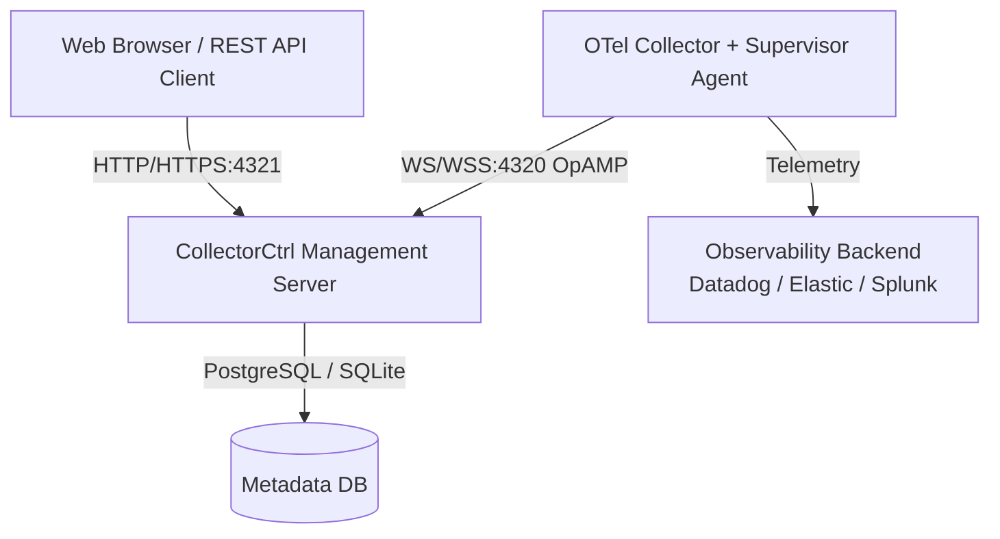

# CollectorCtrl — OpenTelemetry Fleet Control & Governance

[](https://github.com/CollectorCtrl/CollectorCtrl/releases)
[](LICENSE)
[](https://github.com/CollectorCtrl/CollectorCtrl/pkgs/container/collectorctrl-server)
[](https://collectorctrl.com/docs)
[](https://github.com/open-telemetry/opamp-spec)

**Central management, dynamic configuration, and active governance for your entire OpenTelemetry fleet — on-prem, secure, and built on [OpAMP](https://github.com/open-telemetry/opamp-spec).**

[Website](https://collectorctrl.com) · [Documentation](https://collectorctrl.com/docs) · [Releases](https://github.com/CollectorCtrl/CollectorCtrl/releases) · [Report a Bug](https://github.com/CollectorCtrl/CollectorCtrl/issues/new?template=bug_report.yml) · [Request a Feature](https://github.com/CollectorCtrl/CollectorCtrl/issues/new?template=feature_request.yml)

---

CollectorCtrl provides an enterprise-grade, on-prem control plane for managing agent lifecycle, configuration, monitoring, and drift prevention across your entire observability infrastructure — from a single-node lab to fleets of 10,000+ collectors across Windows, Linux, Docker, and Kubernetes.

> 🚀 **CollectorCtrl 1.1.x for Windows & Linux is available** — [Download on GitHub →](https://github.com/CollectorCtrl/CollectorCtrl/releases)

## Key Features

- **Dynamic Target Policies**: Apply Kubernetes-style label selectors to target precise collector rings. Supervisors apply pipeline updates in place with fast, supervised restarts — self-healing and fully automated.
- **Drift Prevention**: CollectorCtrl is the single source of truth. It continuously validates edge configs against defined policies and auto-corrects any divergence.
- **Atomic Versioning & Canary Rollouts**: Every YAML edit is SHA-hashed and versioned. Deploy to a canary ring first, validate under real load, then promote — or rollback in milliseconds.
- **Remote Supervisor Upgrades**: Push Supervisor agent upgrades fleet-wide from the console, with self-healing automatic rollback protection.
- **Hybrid Sidecar Pipelines**: Isolate your observability pipeline from your intelligence pipeline — run separate OTel components for SIEM routing and AI processing without polluting your core telemetry path.
- **OIDC Identity & SSO**: Integrate with Microsoft Entra ID (Azure AD), Okta, and Auth0. Just-in-Time account provisioning with dynamic group-to-role mappings (Admin, Editor, Viewer, and custom roles).
- **SIEM OTLP Audit Streaming**: Every administrator action is streamed in real time as structured OTLP log events directly to your SIEM — no custom integrations required.
- **Cross-Platform**: Native support for Windows Server (Windows Service), Linux (systemd daemon), Docker, and Kubernetes (Helm).

## Architecture

CollectorCtrl consists of a high-performance **Go Backend**, a modern **React-based Web UI** (served directly by the backend — no Node.js needed in production), and a lightweight **Supervisor Agent** deployed on each managed node.


```mermaid
graph TD
    A[OTel Collector + Supervisor Agent] -- WS/WSS:4320 OpAMP --> B[CollectorCtrl Management Server]
    C[Web Browser / REST API Client] -- HTTP/HTTPS:4321 --> B
    B -- PostgreSQL / SQLite --> E[(Metadata DB)]
    A -- Telemetry --> F[Observability Backend<br/>Datadog / Elastic / Splunk]
```

> By default the console is served over plain **HTTP** (`http://<server>:4321`) and agents connect over **`ws://`**. For production, terminate TLS with a reverse proxy (IIS / Nginx / Caddy) or enable native HTTPS — see the [Setup Guide](docs/setup.md#4-production-https).

### System Components

| Component | Role |
| :--- | :--- |
| **Management Server** | On-prem control plane — hosts the Admin UI Console, REST API, and OpAMP WebSocket gateway |
| **Supervisor Agent** | Lightweight OS daemon (Windows Service / Linux systemd) — manages collector lifecycle, drift reconciliation, and self-healing config applies |
| **OTel Collector** | The managed telemetry worker (native OTel, OTel Contrib, or custom binary) |

## Quick Start

### Docker (fastest)

```bash
docker run -d \
  --name collectorctrl \
  --restart always \
  -p 4320:4320 \
  -p 4321:4321 \
  -v collectorctrl-data:/opt/collectorctrl \
  ghcr.io/collectorctrl/collectorctrl-server:latest
```

Then open 👉 **`http://localhost:4321`** and log in with `admin` / `admin` (change the password on first login).

### Windows / Linux Installers

- **Windows**: Download `CollectorCtrl_Setup.exe` (SQLite) or the PostgreSQL edition, run the wizard — it registers the `CollectorCtrl` Windows Service and opens the console automatically.
- **Linux**: Extract the release tarball and run `sudo ./install.sh` — it configures PostgreSQL, registers the `collectorctrl` systemd service, and starts the server.

For full setup instructions including agent installation, network requirements, and production HTTPS, see the [Setup & Installation Guide](docs/setup.md).

## Production Readiness

CollectorCtrl is engineered to scale from a single-node developer instance to global enterprise fleets.

- **Dual-Storage Engine**: Embedded **SQLite** for rapid development; **PostgreSQL** for high-concurrency production workloads (scales to 10,000+ concurrent agents).
- **Cross-Platform Installers**: Windows `.exe` installer via Inno Setup; Linux `.tar.gz` archive with automated `install.sh` script for `apt`/`yum`/`dnf` environments.
- **Zero-Downtime Upgrades**: Built-in database auto-migrations ensure zero data loss during version upgrades.

## Documentation

| Document | Description |
| :--- | :--- |
| [Technical Architecture](docs/architecture.md) | Component deep-dive, data flow, OpAMP protocol, and security model |
| [Setup & Installation Guide](docs/setup.md) | Prerequisites, Windows & Linux install procedures, production HTTPS, troubleshooting |
| [Feature Overview](docs/features.md) | Full platform capabilities overview |
| [Security & Compliance](docs/security.md) | TLS options, RBAC, audit logging, and vulnerability management |
| [Release Notes](RELEASE_NOTES.md) | What's new in the current release line and upgrade instructions |

For the full documentation suite including Fleet Orchestration, Package Management, Custom Builder, Semantic Registry, Telemetry Governor, and System Settings, visit [collectorctrl.com/docs](https://collectorctrl.com/docs).

## Community & Support

- 🐛 [Report a bug](https://github.com/CollectorCtrl/CollectorCtrl/issues/new?template=bug_report.yml) or 💡 [request a feature](https://github.com/CollectorCtrl/CollectorCtrl/issues/new?template=feature_request.yml)
- 🔒 Security disclosures: see [SECURITY.md](SECURITY.md)
- 🤝 Contributing: see [CONTRIBUTING.md](CONTRIBUTING.md) and our [Code of Conduct](CODE_OF_CONDUCT.md)
- 📧 General inquiries: [connect@collectorctrl.com](mailto:connect@collectorctrl.com)

---
*© 2026 CollectorCtrl. The definitive platform for OpenTelemetry fleet governance. On-prem, secure, infinitely scalable.*
