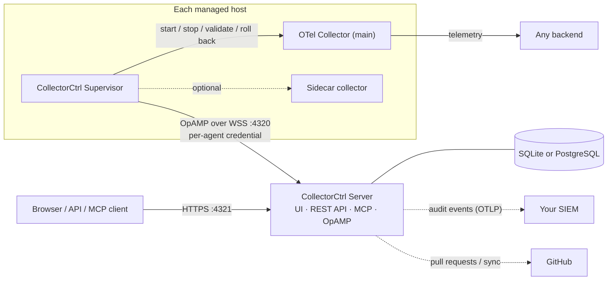

<div align="center">

# CollectorCtrl

### The agentic control plane for OpenTelemetry

Deploy, configure, govern and upgrade your entire OpenTelemetry Collector fleet from one self-hosted control plane, built on [OpAMP](https://github.com/open-telemetry/opamp-spec), neutral to every backend, with an AI Copilot and an MCP server that propose changes for a person to approve.

[](https://github.com/CollectorCtrl/CollectorCtrl/releases)
[](https://github.com/CollectorCtrl/CollectorCtrl/releases)
[](https://github.com/CollectorCtrl/CollectorCtrl/pkgs/container/collectorctrl-server)
[](https://github.com/open-telemetry/opamp-spec)
[](#supported-platforms)

[Website](https://collectorctrl.com) · [Documentation](https://collectorctrl.com/docs) · [Quick start](#quick-start) · [Releases](https://github.com/CollectorCtrl/CollectorCtrl/releases) · [Changelog](CHANGELOG.md) · [Report a bug](https://github.com/CollectorCtrl/CollectorCtrl/issues/new?template=bug_report.yml)

</div>

---

> **Public beta.** The current release is **v0.5.5-beta** (1 October 2026). CollectorCtrl is free to use and self-hosted. Betas can include breaking changes: read the [release notes](RELEASE_NOTES.md) before upgrading, and see [what's stable](#feature-maturity) before planning production use.

## Why CollectorCtrl

OpenTelemetry made the data plane vendor-neutral. The fleet that runs it usually isn't: the fleet managers that ship with observability backends tie collector configuration, upgrades and lifecycle back to that vendor. CollectorCtrl is an independent control plane you run yourself:

- **Any collector:** upstream `otelcol` / `otelcol-contrib`, vendor distributions, or your own builds made with the integrated OpenTelemetry Collector Builder (`ocb`).
- **Any backend:** CollectorCtrl manages the collectors, never your telemetry's destination.
- **Your infrastructure, your AI:** everything runs on-premises or in your cloud. The Copilot works with the model provider your organization approves, including self-hosted OpenAI-compatible endpoints.

## Highlights

| | |
| :--- | :--- |
| **Fleet management over OpAMP** | Live inventory of every collector on Windows, Linux, macOS and containers: health, version, effective config, attributes. Table, honeycomb and topology views. |
| **Policy-driven configuration** | Label-selector policies, SHA-256-versioned configs, canary rollouts with promote and abort, one-click rollback, full configuration history with diffs. |
| **Drift prevention** | Each agent reports its effective config hash. Drift is flagged or reverted automatically, per policy. |
| **Self-healing collectors** | Every new config is validated by the collector before it's applied. A config that crash-loops the collector is rolled back to the last known good one. |
| **GitOps** | Keep policies in GitHub or GitHub Enterprise. Changes arrive as pull requests, sync within seconds via webhook, and drift is shown side by side. |
| **AI Copilot** | Answers from live fleet data, streams its reasoning steps, and proposes changes with a diff and blast radius. **It never applies a change on its own.** A person approves every one. |
| **MCP server** | 60+ governed tools and 4 runbook prompts for Claude Desktop, Cursor or any MCP client. Same RBAC, audit and approval workflow as the UI. |
| **Sidecar pipelines** | Run a second, isolated collector beside the main one, for example to keep a SIEM pipeline running while you change the observability pipeline. |
| **Supervisor and collector lifecycle** | Signed package repository, fleet-wide supervisor and collector upgrades with watchdogs and automatic rollback, and an integrated Custom Builder (`ocb`). |
| **ZeroTouch instrumentation** *(alpha)* | Discover applications on managed hosts and attach OpenTelemetry agents (Java, .NET, Node.js, Python) from the UI, with canary rollout and centrally managed agent versions. |
| **Telemetry Governor** | Edge taps that keep 100% of errors and sample the rest, fan out to S3 or OTLP destinations, and generate filter rules to cut ingest cost. |
| **Enterprise security** | Per-agent enrollment and credentials, TLS by default with a per-install CA, OIDC SSO, granular RBAC, tamper-evident audit trail streamed to your SIEM over OTLP. |

See [docs/features.md](docs/features.md) for the full capability list.

## Quick start

### 1. Run the server

**Docker** (evaluation):

```bash
docker run -d --name collectorctrl --restart unless-stopped \
  -p 4320:4320 -p 4321:4321 \
  -v collectorctrl-data:/var/lib/collectorctrl \
  ghcr.io/collectorctrl/collectorctrl-server:latest
```

> Keep the `/var/lib/collectorctrl` volume. It holds the database, the server's certificate authority and its secrets. Without it, every container restart creates a new CA and your agents can no longer connect.

For production with PostgreSQL, use the [Docker Compose example](examples/docker-compose.yml).

**Windows / Linux / macOS:** download the installer or archive for your platform from the [latest release](https://github.com/CollectorCtrl/CollectorCtrl/releases) and follow the [installation guide](docs/setup.md).

### 2. Sign in

Open **`https://<server>:4321`** and sign in as `admin` / `admin`. You'll be asked to set a new password straight away.

The UI is served over **HTTPS by default**, using a certificate from the CA that the server creates on first start. Your browser will warn that it doesn't recognize this CA until you trust it or [use your own certificate](docs/configuration.md#tls).

### 3. Connect collectors

In the UI, open **Get Started**, create an **enrollment token**, and run the one-line command it shows on each host (Linux, Windows or macOS). The script installs the CollectorCtrl Supervisor, pins the server's CA fingerprint, and enrolls the host with its own credential. Collectors appear in **Fleet** within seconds.

Details: [Connecting collectors](docs/agent-onboarding.md).

## Architecture


```mermaid
flowchart LR
    subgraph Hosts["Each managed host"]
        S["CollectorCtrl Supervisor"] -->|"start / stop / validate / roll back"| C["OTel Collector (main)"]
        S -.->|optional| SC["Sidecar collector"]
    end
    S -- "OpAMP over WSS :4320<br/>per-agent credential" --> CP["CollectorCtrl Server<br/>UI · REST API · MCP · OpAMP"]
    U["Browser / API / MCP client"] -- "HTTPS :4321" --> CP
    CP --- DB[("SQLite or PostgreSQL")]
    CP -. "audit events (OTLP)" .-> SIEM["Your SIEM"]
    CP -. "pull requests / sync" .-> GH["GitHub"]
    C -- "telemetry" --> B["Any backend"]
```

| Component | What it does |
| :--- | :--- |
| **Server** | Single Go binary. Serves the web UI, REST API, MCP endpoint and OpAMP gateway. Stores state in SQLite (default) or PostgreSQL. |
| **Supervisor** | Lightweight agent on each host (Windows service, systemd unit or launchd daemon). Owns the collector's lifecycle, validates and applies config, reports health, and performs signed upgrades. Connects outbound only. |
| **Collector** | Any OpenTelemetry Collector binary: upstream, vendor or custom-built. |

More detail: [docs/architecture.md](docs/architecture.md).

## Supported platforms

| | Server | Supervisor | Release asset |
| :--- | :---: | :---: | :--- |
| Windows (amd64, arm64) | ✅ | ✅ | `.exe` installers (SQLite or PostgreSQL edition for the server) |
| Linux (amd64, arm64) | ✅ | ✅ | `.tar.gz` with `install.sh` and a systemd unit |
| macOS (amd64, arm64) | ✅ | ✅ | `.tar.gz` |
| Docker | ✅ | — | `ghcr.io/collectorctrl/collectorctrl-server` |
| Kubernetes | Single replica | Via the [K8s operator](https://github.com/CollectorCtrl/CollectorCtrl-K8s-Operator) | See [setup notes](docs/setup.md#kubernetes) |

Every release file has a detached `.sig` signature. See [Verifying downloads](docs/verifying-downloads.md).

## Feature maturity

| Status | Features |
| :--- | :--- |
| **Beta** | Fleet management, policies and canary rollouts, drift prevention, configuration history, GitOps, sidecar collectors, supervisor and collector upgrades, package signing, Custom Builder, AI Copilot, MCP server, Telemetry Governor, SSO and RBAC, audit and SIEM streaming |
| **Alpha** | ZeroTouch instrumentation |
| **Not yet available** | Multi-replica high availability (run a single server), enrollment-based auth for the Kubernetes operator |

CollectorCtrl has been load-tested with up to 1,000 collectors on a single server. If you plan a larger fleet, [get in touch](mailto:connect@collectorctrl.com).

## Documentation

| Guide | |
| :--- | :--- |
| [Installation](docs/setup.md) | Docker, Compose, Windows, Linux, macOS, Kubernetes notes, first sign-in |
| [Connecting collectors](docs/agent-onboarding.md) | Enrollment, the Supervisor, `supervisor.yaml`, sidecars, vendor collectors |
| [Configuration reference](docs/configuration.md) | Environment variables, TLS modes, data directory, ports |
| [Upgrading, backup and restore](docs/upgrading.md) | Upgrade checklist, breaking changes in 0.5.x, backup/restore |
| [Features](docs/features.md) | Everything CollectorCtrl does today |
| [AI Copilot and MCP](docs/ai-copilot-and-mcp.md) | Model providers, approvals, MCP tools, connecting Claude Desktop or Cursor |
| [GitOps](docs/gitops.md) | Managing fleet policies in a GitHub repository |
| [Architecture](docs/architecture.md) | Components, protocols, data flow |
| [Security](docs/security.md) | Identity, TLS, RBAC, audit, package signing |
| [Verifying downloads](docs/verifying-downloads.md) | Checking release signatures |
| [Release notes](RELEASE_NOTES.md) · [Changelog](CHANGELOG.md) | What changed, release by release |

REST API: the OpenAPI specification for the current release is in [docs/api/openapi.json](docs/api/openapi.json), and every server serves its own copy at `/api/docs/openapi.json`.

## Community and support

- 🐛 [Report a bug](https://github.com/CollectorCtrl/CollectorCtrl/issues/new?template=bug_report.yml) · 💡 [Request a feature](https://github.com/CollectorCtrl/CollectorCtrl/issues/new?template=feature_request.yml)
- 🔒 Security issues: please follow [SECURITY.md](SECURITY.md), not public issues
- 🤝 [Contributing](CONTRIBUTING.md) · [Code of Conduct](CODE_OF_CONDUCT.md)
- 📧 Beta programme, partnerships and general questions: [connect@collectorctrl.com](mailto:connect@collectorctrl.com)

## License

CollectorCtrl is free to use. See [LICENSE](LICENSE) and [NOTICE](NOTICE). CollectorCtrl includes software developed by The OpenTelemetry Authors.

---

<sub>OpenTelemetry and OpAMP are projects of the Cloud Native Computing Foundation. CollectorCtrl is an independent project and is not affiliated with or endorsed by the CNCF.</sub>
