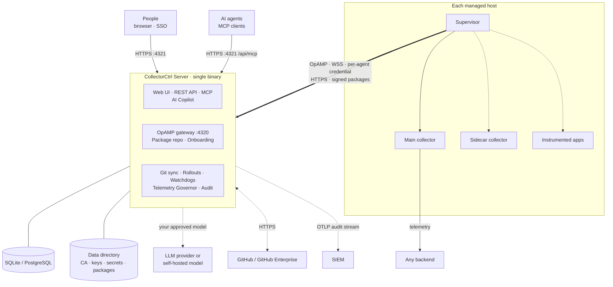

# Architecture

CollectorCtrl is a self-hosted control plane for OpenTelemetry Collector fleets. It manages collectors; it never sits in the telemetry data path.

## Components

### Server

A single Go binary that embeds the web UI and serves:

- the **web UI** and **REST API** (port 4321, HTTPS), including onboarding scripts, the server CA and package downloads for supervisors;
- the **MCP endpoint** (`/api/mcp`) for AI clients;
- the **OpAMP gateway** (port 4320, WSS) that every supervisor connects to;
- background services: Git sync, canary and rollout state, upgrade governor and watchdogs, notifications, SIEM audit streaming, Telemetry Governor analytics.

State lives in **SQLite** (default) or **PostgreSQL**, plus a **data directory** that holds the per-install CA, private keys and secrets (see [Configuration](configuration.md#data-directory)). Run **one server instance**: multi-replica high availability is on the roadmap.

### Supervisor

A small OS-native agent on each host: a Windows service, systemd unit or launchd daemon. It:

- keeps a persistent, authenticated OpAMP connection to the server (outbound only);
- starts, stops and restarts the **main** collector and an optional **sidecar** collector, independently;
- **validates every new configuration** with the collector before applying it, and rolls back to the last known good config if a new one crash-loops the collector;
- reports health, effective configuration and its hash, component details and attributes;
- installs **signed** collector and supervisor packages, with a connection watchdog that rolls back a supervisor upgrade that can't reconnect;
- optionally discovers and instruments applications (ZeroTouch).

The Supervisor keeps running, and stays reachable, when the collector crashes.

### Collector

Any OpenTelemetry Collector binary: upstream `otelcol` / `otelcol-contrib`, a vendor distribution, or a build from the integrated Custom Builder (`ocb`).

## Configuration flow

1. A change is made in the UI, through the API or MCP (after approval), or merged in Git.
2. The server resolves which collectors it applies to (policy selectors, overrides, canary cohort), validates the YAML, stores the new version with its SHA-256 and history, and writes an audit entry.
3. The configuration is sent to each matching supervisor over OpAMP. Offline collectors receive it when they reconnect.
4. The supervisor merges it with local configuration sources, has the collector validate it, then restarts only the pipeline whose configuration changed (main or sidecar).
5. The supervisor reports the applied hash back. The server marks the change delivered and confirmed, or failed with the collector's error.
6. From then on, every heartbeat carries the effective config hash. A difference is reported as **drift** and, per policy, reverted.

## Agent identity and transport

- The server creates its own **CA** on first start and serves TLS on both ports. Supervisors pin the CA's SHA-256 fingerprint at enrollment.
- Each supervisor enrolls once with a short-lived **enrollment token** and receives a **per-agent credential** bound to its instance UID. Later connections authenticate with that credential, and a connection can't act as another instance.
- Telemetry Governor taps get per-agent tap tokens issued by the server over OpAMP.

More detail: [Security](security.md).

## Ports

| Port | Direction | Purpose |
| :--- | :--- | :--- |
| 4320 | Inbound to server | OpAMP gateway (WSS) |
| 4321 | Inbound to server | UI, REST API, MCP, onboarding, package downloads (HTTPS) |
| 5432 | Server to database | PostgreSQL, if used |
| 13133 | Local on each host | Collector health check |
